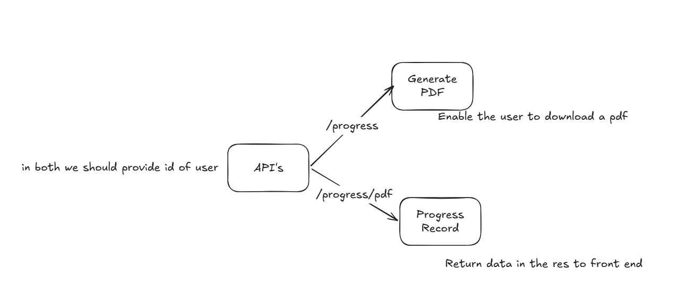

# Reporting System

## AT FIRST WE SHOULD SPECIFY REQUIRMENTS AND MAKE A PHASES TO INTEGRATIONS

## HINTS $ clarifications
*The reports will be sended in a specific time, but also admins have the api to check progress at any time*

## Phase 1
### scenario
*we have user id , so we can check its progres by using /progress api or download progress in form of PDF.*

### input
*user id*

### output
*records or pdf*

## phase 2

*Automation is the language of the Generation so we need to make the progress of users is automatically sended , so we need add timing feature to resend the progress.*
**this will help to call the api without humman action "Automation". **

## phase 3

*Add channels to make the Automation meaningful and has great impact on users*

** Connect Automation to tools . **
